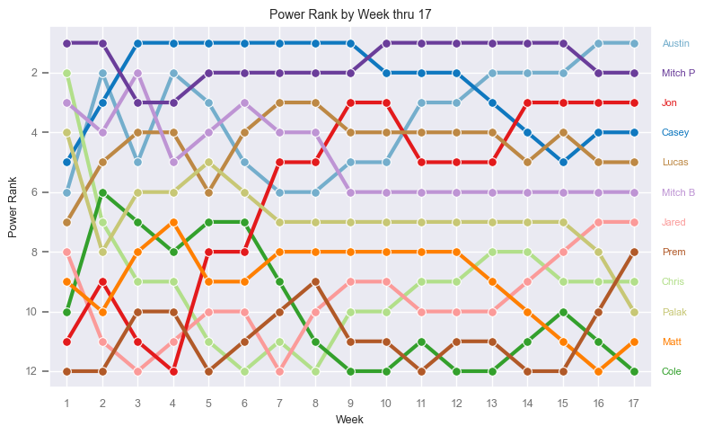
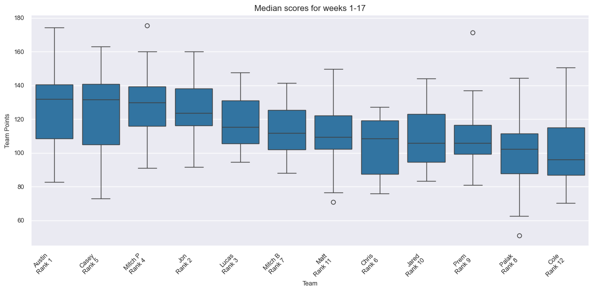
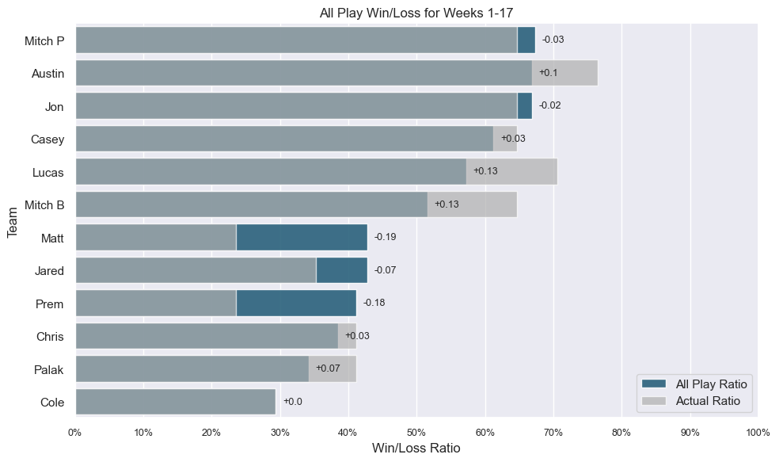
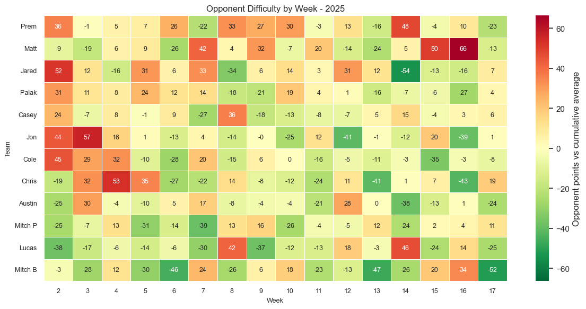
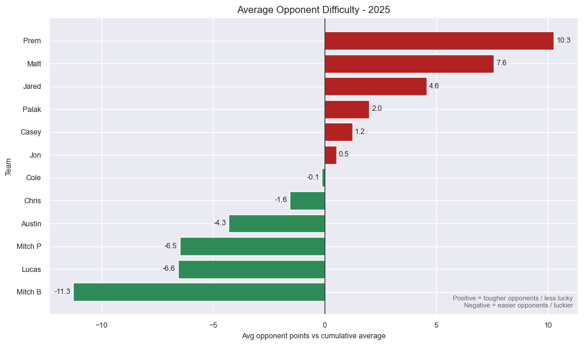
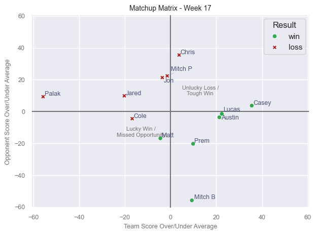
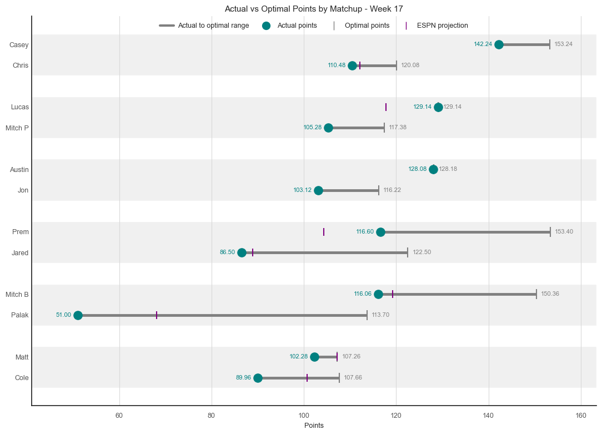

# ESPN Fantasy Football Metrics

A Python project that pulls raw ESPN Fantasy Football data from the public ESPN API,
converts nested JSON responses into datasets, and generates 
weekly fantasy football performance metrics and insights.

This project uses fantasy football as an analytics sandbox to demonstrate API extraction, 
data manipulation, metric design, performance analysis, and repeatable reporting.

## Overview

Fantasy football data is useful for analytics because it combines structured team data, 
weekly time-series results, effects from opponents, and rankings.

The project analyzes league performance across several topics:

- **Weekly scoring trends:** team points, league averages, opponent points, and 
week-over-week movement.
- **Actual vs optimal efficiency:** compares submitted lineups against the best 
possible lineup from each team.
- **All-play performance:** estimates how each team would perform against every 
other team each week.
- **Power rankings:** creates a custom ranking using scoring average, high score, 
and win percentage.
- **Opponent difficulty:** measures whether teams faced opponents who scored above 
or below their prior cumulative average.

## Project Goal

The goal of this project is to create a repeatable weekly analytics workflow that 
answers questions such as:

- Which teams are strongest?
- Which teams are winning because they are consistently good vs have favorable matchups?
- Which managers are leaving the most points on the bench?
- How did team strength change throughout the season?
- Did draft position have any relationship with final rank?
- Which playoff teams peaked at the right time?

## Analytics Workflow

The weekly report follows this process:

1. Pull team, matchup, roster, and scoring data from the ESPN Fantasy API.
2. Normalize JSON responses into pandas DataFrames.
3. Create weekly matchup metrics, including team score, opponent score, 
league average, win/loss, all-play wins, and power rank.
4. Create lineup-efficiency metrics by comparing actual submitted lineups to 
the optimal lineup.
5. Generate chart outputs and supporting datasets in the `outputs/` folder.

## Setup & Execution

This project requires ESPN authentication for private fantasy leagues. Store the following 
values locally in a `.env` file or as Windows environment variables.

| Variable    | Description                   |
|-------------|-------------------------------|
| `LEAGUE_ID` | ESPN fantasy league ID        |
| `SWID`      | ESPN SWID cookie              |
| `ESPN_S2`   | ESPN_S2 authentication cookie |

To find the cookie values, log in to ESPN Fantasy Football in your browser and open 
your browser developer tools. In Firefox, go to the Storage tab and look for cookies 
named `espn_s2` and `SWID`.

To find your league ID, open your ESPN Fantasy league homepage and check the page 
URL for a value similar to `leagueId=999999`.

### Running the Weekly Report

Run `scripts/run_weekly.py` to create the weekly datasets and chart outputs.

The script currently generates:

- Weekly Score Data
- Opponent Difficulty
- Weekly Scoring Charts
- All-play Chart
- Power Ranking Charts
- Actual vs Optimal Lineup Charts
- Draft Position vs Rank Chart

Outputs are saved to the `outputs/` folder.

## Example Metrics & Findings

The examples below use the full 2025 season through Week 17. Some charts will show 
weekly numbers, while others are a "season-to-date" summary.

### 1. Final standings did not match raw scoring strength

Austin finished as the champion and also ranked first in the custom power ranking 
by Week 17. Austin averaged 127.5 points per week, had a 76.5% actual win rate, 
and "improved" from draft position 11 to final rank 1.

Mitch P had the highest average score of the season at 129 points per week, but 
finished 4th. This shows why the project separates raw scoring strength from final 
standings, since playoff timing and matchup structure can create different outcomes.

Jon also significantly "outperformed" draft position, moving from draft position 12 
to final rank 2 while maintaining one of the strongest all-play profiles in the league.

### 2. All-play results exposed the effects of matchups and schedules

All-play ratio shows how often each team would have beaten every other 
team each week. This helps separate team quality from head-to-head schedule luck.

Mitch P had the best all-play ratio at approximately 67.4%, followed closely by 
Austin and Jon at approximately 66.8%. Lucas had a strong actual win rate of 70.6%, 
but a lower all-play ratio of 57.2%, suggesting his record was stronger 
than his weekly scoring.

Matt and Prem had all-play ratios around 42.8% and 41.2%, but both finished with 
actual win rates of only 23.5%. This suggests both teams were less successful in actual 
matchups and were impacted by difficult matchups.

### 3. Opponent difficulty showed schedule variance

Opponent difficulty compares each opponent’s weekly score against that opponent’s 
cumulative average. Positive values mean a team faced opponents who scored above 
their usual level, and negative means the team faced opponents who scored below their 
average.

Prem had the toughest average opponent difficulty at +10.3 points, followed by Matt 
at +7.6 and Jared at +4.6. Mitch B had the easiest average opponent difficulty at 
-11.3 points, followed by Lucas at -6.6 and Mitch P at -6.5.

This metric helps explain why standings and raw team quality can diverge. A team can 
score reasonably well and still struggle if opponents repeatedly overperform in 
their matchups.

The matchup matrix is similar to all-play, and adds additional weekly context into 
the impact of matchups. This helps identify matchup outcomes like hard-fought 
losses and lucky wins. For example, a team may win despite scoring below average
if their opponent also had a bad week.

### 4. Week 17 lineup efficiency had several missed-point opportunities

The Week 17 actual vs optimal chart compares each team’s submitted lineup score 
against the maximum available points from their roster.

Lucas and Austin were optimal in Week 17. In contrast, Palak and Prem left 
approximately 62.7 and 36.8 points on the bench respectively.

This metric shows how a strong roster can still underperform if the 
wrong players are started.
 

## Example Output Files

| Output                                    | Description                                                                                                                     |
|-------------------------------------------|---------------------------------------------------------------------------------------------------------------------------------|
| `weekly_score_data.xlsx`                  | Matchup-level weekly dataset with team scores, opponent scores, ranks, weekly averages, all-play wins, and power ranking fields |
| `opponent_difficulty_2025.csv`            | Opponent difficulty dataset                                                                                                     |
| `1-pos_to_rank_max17.png`                 | Draft position vs final rank regression                                                                                         |
| `2-diff_draft_to_final_max17.png`         | Draft position movement by team                                                                                                 |
| `3-weekly_avg_scores_max17.png`           | Weekly league average scoring trend                                                                                             |
| `4-all_play_wins17.png`                   | All-play ratio vs actual win ratio                                                                                              |
| `5-median_scores_max17.png`               | Team scoring distribution                                                                                                       |
| `7-power_ranking_by_week_max17.png`       | Power ranking movement by week                                                                                                  |
| `9-week17_matchup_chart.png`              | Week 17 matchup matrix                                                                                                          |
| `10-week17_actual_vs_optimal.png`         | Actual vs optimal lineup score                                                                                                  |
| `12-year_2025_opp_difficulty_heatmap.png` | Weekly opponent difficulty heatmap                                                                                              |
| `14-year_2025_opp_difficulty_summary.png` | Average opponent difficulty by team                                                                                             |

## Limitations
* ESPN does not provide official documentation for the API, so responses may change.
* Private leagues require ESPN authentication cookies.
* Optimal lineup logic assumes a standard roster structure and may require adjustment 
for unusual league formats.
* Opponent difficulty is descriptive, not predictive. It measures how difficult a team’s 
schedule was based on opponent scoring relative to prior performance.
* All-play analysis estimates relative team strength, but actual league outcomes still 
depend on scheduled weekly matchups and playoff timing.

## Future Enhancements
Future versions of this project could expand from descriptive weekly reporting into more 
forward-looking analytics.

### Injury impact analysis
Player injuries can materially change the season outlook for a team, especially when a 
highly drafted play misses significant time. Losing a top player can reduce weekly scoring 
potential and force weaker lineup decisions.

A future enhancement would estimate injury impact by combining roster data, player
projections, and weekly injury status. This would help answer questions such as:
* Which teams lost the most projected points due to injury?
* Did injuries explain under performance?
* Which injured players had the largest impact on team playoff changes?

### Projection-adjusted power rankings
The current power ranking model is based primarily on historical team scoring, high 
scores, and win percentage. This is useful for evaluating past performance, but
does not account for potential future roster strength.

A future enhancement would update power rankings to include player projections, allowing 
rankings to show both how teams have performed so far, but also how strong the rosters
are expected to be going forward.

Potential additions include:
* Rest-of-season player projections
* Bench depth by position
* Player volatility or consistency
* Rest-of-season strength for each player's team
